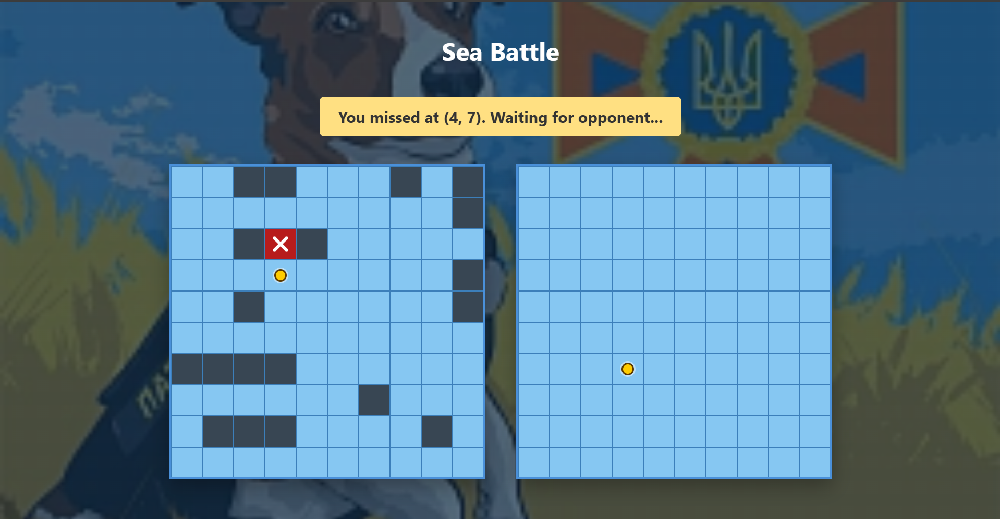
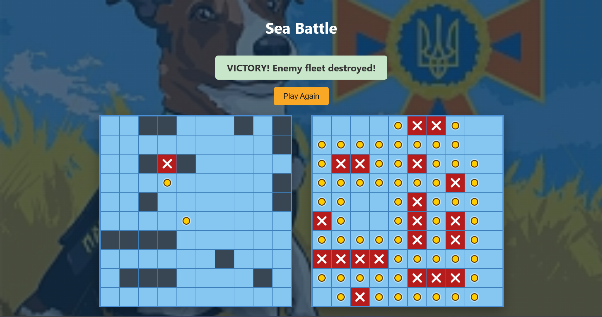
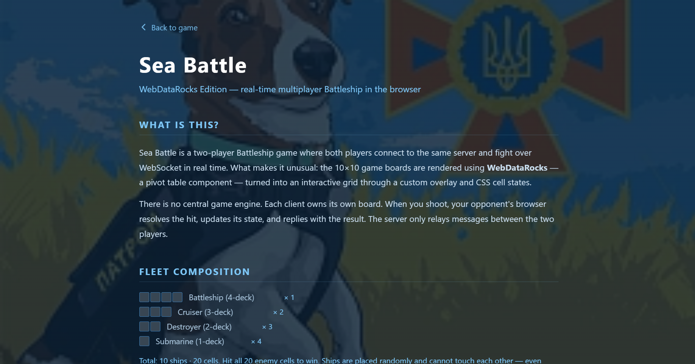

# Sea Battle — WebDataRocks Edition

A real-time multiplayer Battleship game running in the browser, where the 10×10 game boards are rendered using **WebDataRocks** pivot tables as an unconventional rendering engine.

## Play Online

**[sea-battle-webdatarocks.onrender.com](https://sea-battle-webdatarocks.onrender.com)**

Open the link in two browser tabs or share it with a friend — the room holds exactly 2 players. If someone is already playing, you'll have to wait until the game ends.

---

## Screenshots

### Gameplay — hits and misses


### Victory


### About page


Two players connect to the same room, place their fleets, click Ready, and take turns shooting at the opponent's board. Hits grant an extra turn; sinking a ship automatically reveals all surrounding water. The first player to destroy all 20 enemy ship cells wins.

---

## How It Works

Each board is a WebDataRocks pivot table with `x` as columns and `y` as rows. A custom `battle-grid-overlay` renders on top for click handling and CSS-driven cell states. Shooting sends a `SHOOT` message to the Node.js WebSocket server, which relays it to the opponent. The opponent's client resolves the hit, marks surrounding water on sunk ships, and replies with a `RESULT` message — all without any round-trips through a central game engine.

---

## Fleet Composition

| Ship | Count | Cells |
|------|-------|-------|
| Battleship (4-deck) | 1 | 4 |
| Cruiser (3-deck) | 2 | 6 |
| Destroyer (2-deck) | 3 | 6 |
| Submarine (1-deck) | 4 | 4 |
| **Total** | **10 ships** | **20 cells** |

---

## Features

- Random fleet generation with strict gap enforcement — ships cannot touch even diagonally
- Automatic reveal of water cells surrounding a sunk ship
- Consecutive-turn bonus on a hit
- Real-time sync via WebSocket — zero polling
- Background music starts when both players are ready and the match begins
- Disconnect detection with instant opponent notification
- Play Again without page reload or WebSocket reconnect
- Path traversal protection on the static file server

---

## Tech Stack

| Layer | Technology |
|-------|-----------|
| Board rendering | WebDataRocks (pivot table) |
| Frontend | Vanilla JavaScript (ES modules) |
| Bundler | Webpack |
| Real-time | WebSocket (`ws`) |
| Server | Node.js `http` + `ws` |
| Styling | CSS (custom battle grid overlay) |

---

## Getting Started

### Prerequisites

- Node.js 16+
- npm

### Install & Run

```bash
npm install
npm run build
npm start
```

Open `http://localhost:8080` in **two browser tabs** to play locally, or share the address with another player on the same network.

### Environment

| Variable | Default | Description |
|----------|---------|-------------|
| `PORT` | `8080` | HTTP + WebSocket server port |

---

## How to Play

1. Open `http://localhost:8080` in two browser tabs.
2. Click **Generate Fleet** to re-randomize your ship positions (optional).
3. Click **Ready** in both tabs — the game starts when both players confirm.
4. Click cells on the **right board** (enemy) to shoot.
5. A hit lets you shoot again. A miss passes the turn to your opponent.
6. When a ship is fully sunk, all surrounding cells are automatically marked as water.
7. The first player to hit all 20 enemy cells wins.
8. Click **Play Again** to start a new round — no reconnect needed.

---

## WebSocket Protocol

| Message type | Direction | Purpose |
|-------------|-----------|---------|
| `READY` | Client → Server | Player declares ready |
| `OPPONENT_READY` | Server → Client | Notify the waiting player |
| `start` | Server → Client | Begin game, assign player IDs (1 or 2) |
| `SHOOT` | Client → Client (relayed) | Fire at coordinate `(x, y)` |
| `RESULT` | Client → Client (relayed) | Report hit/miss + sunk surroundings |
| `PLAY_AGAIN` | Broadcast | Reset round state on both sides |
| `DISCONNECT` | Server → Client | Opponent disconnected |

---

## Project Structure

```
src/
  index.js        game logic, WebSocket client, UI state machine
  gameBoard.js    fleet generation + WebDataRocks board renderer
  style.css       game styles and battle grid overlay

server/
  server.js       HTTP static server + WebSocket game server

dist/
  index.html      game HTML shell
  main.js         Webpack bundle
  music.mp3       background music
```
